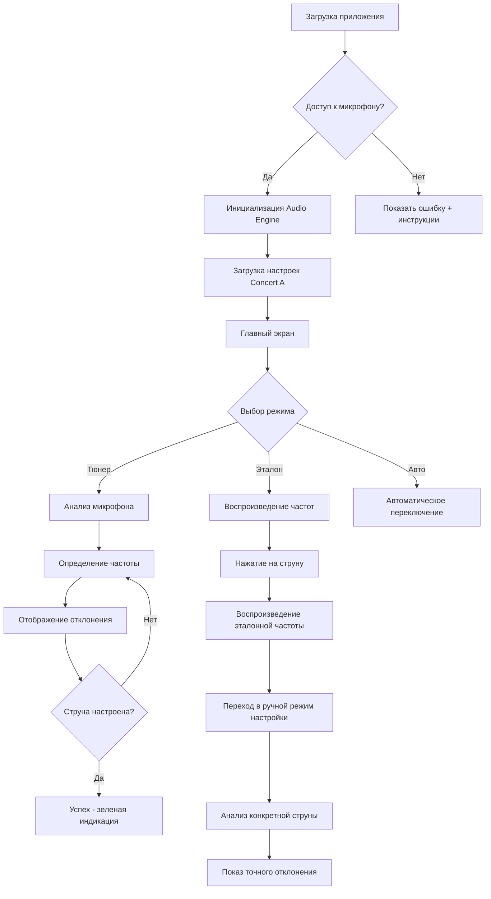
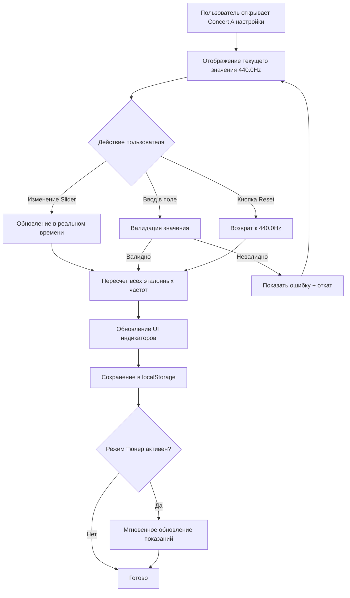
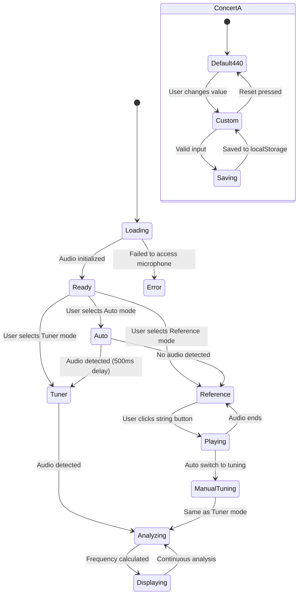

# Simple Tuner - User Flow Diagrams

## Основной пользовательский поток

```mermaid
flowchart TD
    A[Загрузка приложения] --> B{Доступ к микрофону?}
    B -->|Да| C[Инициализация Audio Engine]
    B -->|Нет| D[Показать ошибку + инструкции]
    
    C --> E[Загрузка настроек Concert A]
    E --> F[Главный экран]
    
    F --> G{Выбор режима}
    G -->|Эталон| H[Воспроизведение частот]
    G -->|Тюнер| I[Анализ микрофона]
    G -->|Авто| J[Автоматическое переключение]
    
    H --> K[Нажатие на струну]
    K --> L[Воспроизведение эталонной частоты]
    L --> M[Переход в ручной режим настройки]
    
    I --> N[Определение частоты]
    N --> O[Отображение отклонения]
    O --> P{Струна настроена?}
    P -->|Нет| N
    P -->|Да| Q[Успех - зеленая индикация]
    
    M --> R[Анализ конкретной струны]
    R --> S[Показ точного отклонения]
```

## Concert A Management Flow

```mermaid
flowchart TD
    A[Пользователь открывает Concert A настройки] --> B[Отображение текущего значения 440.0Hz]
    B --> C{Действие пользователя}
    
    C -->|Изменение Slider| D[Обновление в реальном времени]
    C -->|Ввод в поле| E[Валидация значения]
    C -->|Кнопка Reset| F[Возврат к 440.0Hz]
    
    D --> G[Пересчет всех эталонных частот]
    E -->|Валидно| G
    E -->|Невалидно| H[Показать ошибку + откат]
    
    G --> I[Обновление UI индикаторов]
    I --> J[Сохранение в localStorage]
    J --> K{Режим Тюнер активен?}
    
    K -->|Да| L[Мгновенное обновление показаний]
    K -->|Нет| M[Готово]
    
    F --> G
    H --> B
    L --> M
```

## Component State Diagram

```mermaid
stateDiagram-v2
    [*] --> Loading
    Loading --> Ready: Audio initialized
    Loading --> Error: Failed to access microphone
    
    Ready --> Reference: User selects Reference mode
    Ready --> Tuner: User selects Tuner mode  
    Ready --> Auto: User selects Auto mode
    
    Reference --> Playing: User clicks string button
    Playing --> Reference: Audio ends
    Playing --> ManualTuning: Auto switch to tuning
    
    Tuner --> Analyzing: Audio detected
    Analyzing --> Displaying: Frequency calculated
    Displaying --> Analyzing: Continuous analysis
    
    Auto --> Reference: No audio detected
    Auto --> Tuner: Audio detected (500ms delay)
    
    ManualTuning --> Analyzing: Same as Tuner mode
    
    state ConcertA {
        [*] --> Default440
        Default440 --> Custom: User changes value
        Custom --> Default440: Reset pressed
        Custom --> Saving: Valid input
        Saving --> Custom: Saved to localStorage
    }
```
